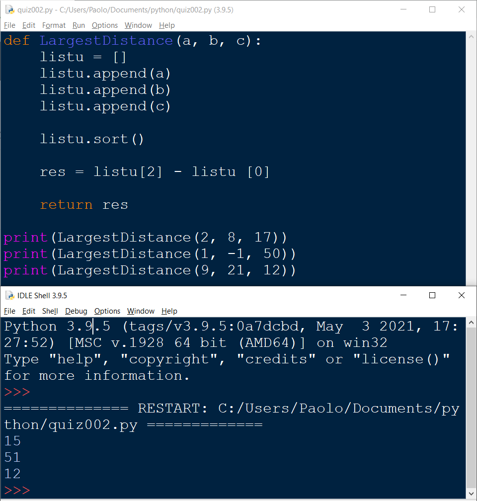

## Quiz #002

```.py
# This program helps find the difference between the largest and smallest number from
# a series of 3 inputted numbers

def LargestDistance(a, b, c):
    listu = []
    listu.append(a)
    listu.append(b)
    listu.append(c)

    listu.sort()

    res = listu[2] - listu [0]

    return res
```
Prove that this works:

