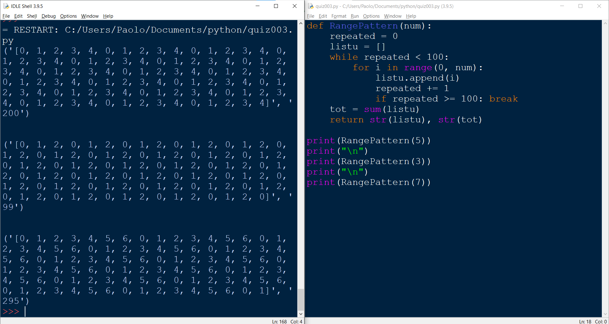

## Quiz #003

Originally Proposed Solution:
```.py
# This program helps repeat a pattern from 0 to the number inputted minus 01 until there's a hundred numbers. 
# Then, it outputs also the sum of such numbers.

def RangePattern(num):
    repeated = 0
    listu = []
    while repeated < 101:
        for i in range(0, num):
            listu.append(i)
            repeated += 1
    tot = listu.sum()

    return str(listu + tot)
```

Corrected Solution:
```.py
# This program helps repeat a pattern from 0 to the number inputted minus 01 until there's a hundred numbers. 
# Then, it outputs also the sum of such numbers.

def RangePattern(num):
    repeated = 0
    listu = []
    while repeated < 100:
        for i in range(0, num):
            listu.append(i)
            repeated += 1
            if repeated >= 100: break
    tot = sum(listu)
    return str(listu), str(tot)
```

Prove that it works:

