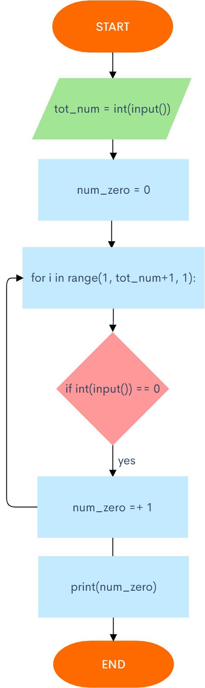
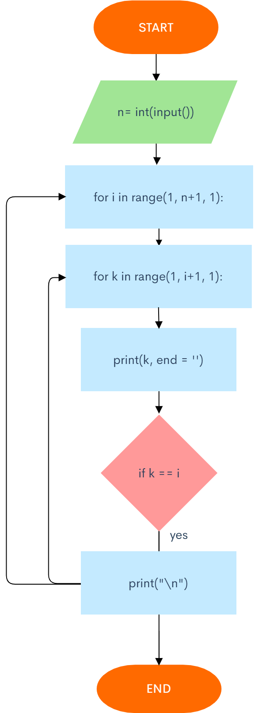

## For Loop Exercises
Paolo Díaz

### 1. Series - 1

Given two integers A and B (A ≤ B). Print all numbers from A to B inclusively.


```.py
a = int(input("Enter the number you wish to start with"))
b = int(input("Enter the number you wish to end with"))

if b>a:
  for i in range(a, b + 1, 1):
    print(i)
else:
  print("ERROR")
```

### 2. Series - 2

Given two integers A and B. Print all numbers from A to B inclusively, in ascending order, if A < B, or in descending order, if A ≥ B.


```.py
a = int(input("Enter the number you wish to start with"))
b = int(input("Enter the number you wish to end with"))

if a < b:
    for i in range(a, b+1, 1):
        print(i)
elif a >= b:
    for i in range(a, b-1, -1):
        print(i)
```

### 3. Sum of 10 numbers

10 numbers are given in the input. Read them and print their sum. Use as few variables as you can.


```.py
list = []
for i in range(10):
    a = int(input("Input a"))
    list.append(a)
print(sum(list))
```

### 4. Sum of n numbers

N numbers are given in the input. Read them and print their sum.
The first line of input contains the integer N, which is the number of integers to follow. Each of the next N lines contains one integer. Print the sum of these N integers.


```.py
n = int(input("input number of elements"))
list = []
for i in range(n):
    a = int(input("Input a"))
    list.append(a)
y = sum(list)
print(y)
```

### 5. Sum of cubes

For the given integer N calculate the following sum:
1^3 + 2^3 + … + N^3


```.py
n = int(input("input the n term"))
x = 0

for i in range (1, n+1, 1):
    new = (i ** 3)
    x =+ x + new
print(x)
```

### 6. Factorial

In mathematics, the factorial of an integer n, denoted by n! is the following product:
n! = 1 × 2 × … × n
For the given integer n calculate the value n!
Don't use math module in this exercise.


```.py
factorial = int(input("Input the number you wish to know the factorial of"))
answ = 1
for i in range(1, factorial+1, 1):
    answ = answ * i
print(answ)
```

### 7. Number of zeroes

Given N numbers: the first number in the input is N, after that N integers are given. Count the number of zeros among the given integers and print it.
You need to count the number of numbers that are equal to zero, not the number of zero digits.



```.py
tot_num = int(input("Input the total of numbers to know"))
num_zero = 0
for i in range(1, tot_num+1, 1):
    if int(input()) == 0:
        num_zero += 1
print(num_zero)
```

### 8. Adding Factorials

Given an integer n, print the sum 1! + 2! + 3! + ... + n!

This problem has a solution with only one loop, so try to discover it. And don't use the math library :)


```.py
n = int(input("Input the n term"))
factorial = 1
total = 0
for i in range(1, n + 1, 1):
    factorial *= 
    total += factorial
print(total)
```

### 9. Ladder

For given integer n ≤ 9 print a ladder of n steps. The k-th step consists of the integers from 1 to k without spaces between them.
To do that, you can use the sep and end arguments for the function print().



```.py
n = int(input("Input the n term"))

for i in range(1, n + 1, 1):
    for k in range(1, i + 1, 1):
        print(k, end = '')
        if k == i:
            print("\n")
```

### 10. Lost card

There was a set of cards with numbers from 1 to N. One of the card is now lost. Determine the number on that lost card given the numbers for the remaining cards.
Given a number N, followed by N − 1 integers - representing the numbers on the remaining cards (distinct integers in the range from 1 to N). Find and print the number on the lost card.


```.py
n  = int(input())
list = []
for i in range(1, n, 1):
    a = int(input())
    list.append(a) 
## Put all known numbers on a list

for i in range(1, n+1, 1):
    if not i in list:
        print(i)

## Generated from 1 to the n number (firstly given to us) and checked if these were on the list. Printed the one that wasn't.
```
