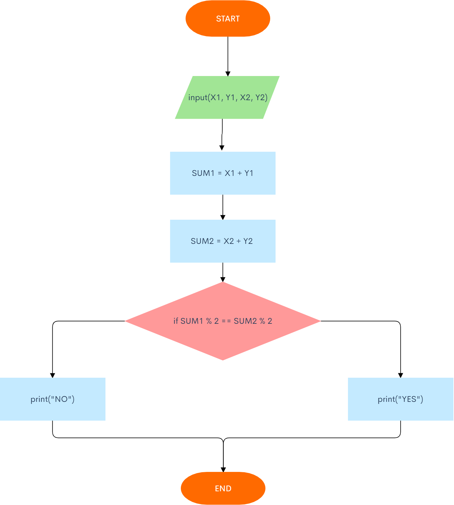
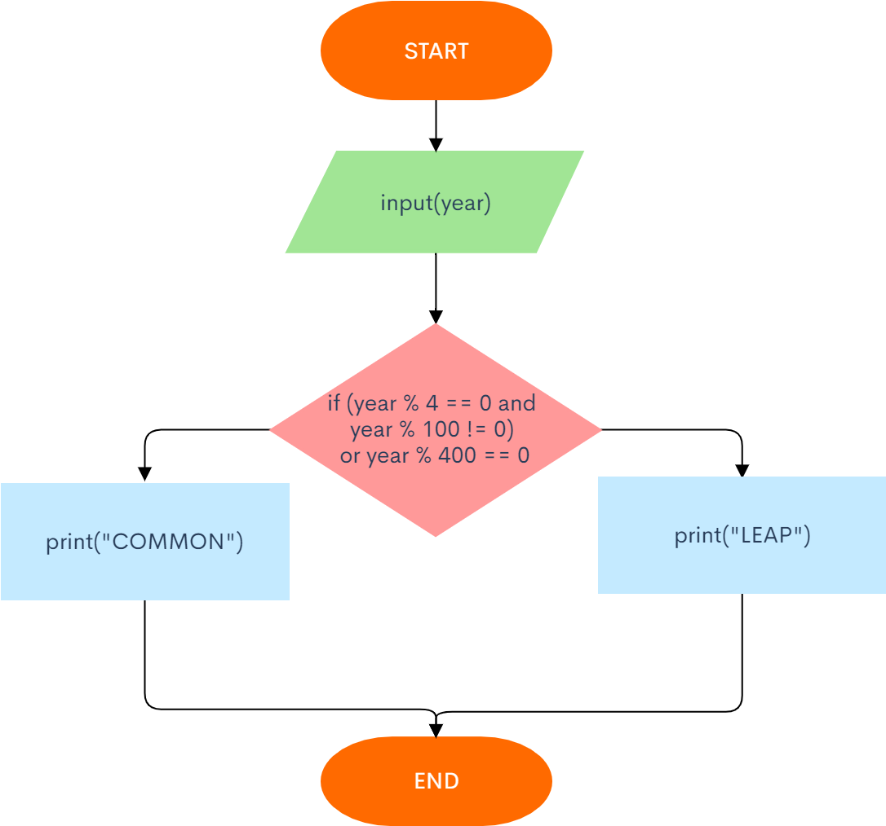

## If Exercises
Paolo Díaz

### 1. Minimum of two numbers
Given two integers, print the smaller value.


```.py
N1 = int(input("Number 01"))
N2 = int(input("Number 02"))

if N1 > N2:
    print(N2)
else:
    print(N1)
```

### 2. Sign Function
For the given integer X print 1 if it's positive, -1 if it's negative, or 0 if it's equal to zero.
Try to use the cascade if-elif-else for it.


```.py
x = int(input("Input a number "))

if x > 0:
    print("1")
elif x == 0:
    print("0")
else:
    print("-1")
```

### 3. Minimum of Three Numbers
Given three integers, print the smallest value.


```.py
a = int(input("Input one number: "))
b = int(input("Input another number: "))
c = int(input("Input anoooother number: "))

if a>b:
    if b>c:
        print(c)
    else:
        print(b)
else:
    if a>c:
        print(c)
    else:
        print(a)
```

### 4. Equal Numbers
Given three integers, determine how many of them are equal to each other. The program must print one of these numbers: 3 (if all are the same), 2 (if two of them are equal to each other and the third is different) or 0 (if all numbers are different).


```.py
a = int(input("Input one number: "))
b = int(input("Input another number: "))
c = int(input("Input anoooother number: "))

if a == b:
    if b == c:
        print(3)
    else:
        print(2)
else:
    if a == c:
        print(2)
    elif b == c:
        print(2)
    else:
        print(0)
```

### 5. Rook Move

Chess rook moves horizontally or vertically. Given two different cells of the chessboard, determine whether a rook can go from the first cell to the second in one move.
The program receives the input of four numbers from 1 to 8, each specifying the column and row number, first two - for the first cell, and then the last two - for the second cell. The program should output YES if a rook can go from the first cell to the second in one move, or NO otherwise.


```.py
OY = int(input("From 1 to 8, input the Original column of the rook"))
OX = int(input("From 1 to 8, input the Original row of the rook"))

NY = int(input("From 1 to 8, input the New column of the rook"))
NX = int(input("From 1 to 8, input the New row of the rook"))

if OX == NX:
    print("YES")
elif OY == NY:
    print("YES")
else:
    print("NO")
```

### 6. Chess board - same color

Given two cells of a chessboard. If they are painted in one color, print the word YES, and if in a different color - NO.
The program receives the input of four numbers from 1 to 8, each specifying the column and row number, first two - for the first cell, and then the last two - for the second cell.



```.py
Y1 = int(input("From 1 to 8, input the first column"))
X1 = int(input("From 1 to 8, input the first row"))

Y2 = int(input("From 1 to 8, input the second column"))
X2 = int(input("From 1 to 8, input the second row"))

SUM1 = X1 + Y1
SUM2 = X2 + Y2

# Here we see that the sum of the coordinates of every black tile will always be even, while the sum of the coordinates of 
# every white tile will always be odd, so that to know if they're the same color, we examine if both results are odd or 
# even by dividing them by 2 and obtaining the result.

if SUM1 % 2 == SUM2 % 2:
    print("YES")
else:
    print("NO")
```

### 7. King move

Chess king moves horizontally, vertically or diagonally to any adjacent cell. Given two different cells of the chessboard, determine whether a king can go from the first cell to the second in one move.
The program receives the input of four numbers from 1 to 8, each specifying the column and row number, first two - for the first cell, and then the last two - for the second cell. The program should output YES if a king can go from the first cell to the second in one move, or NO otherwise.


```.py
OY = int(input("From 1 to 8, input the Original column of the rook"))
OX = int(input("From 1 to 8, input the Original row of the rook"))

NY = int(input("From 1 to 8, input the New column of the rook"))
NX = int(input("From 1 to 8, input the New row of the rook"))

if NY == OY + 1 or NY == OY - 1 or NY == OY: 
    if NX == OX + 1 or NX == OX - 1 or NX == OX:
        print("YES")
    else:
        print("NO")
else:
    print("NO")
```

### 8. Bishop Move

In chess, the bishop moves diagonally, any number of squares. Given two different squares of the chessboard, determine whether a bishop can go from the first to the second in one move.
The program receives as input four numbers from 1 to 8, specifying the column and row numbers of the starting square and the column and row numbers of the ending square. The program should output YES if a Bishop can go from the first square to the second in one move, or NO otherwise.


```.py
OY = int(input("From 1 to 8, input the Original column of the bishop"))
OX = int(input("From 1 to 8, input the Original row of the bishop"))

NY = int(input("From 1 to 8, input the New column of the bishop"))
NX = int(input("From 1 to 8, input the New row of the bishop"))

Dist_Y = abs(OY - NY)
Dist_X = abs(OX - NX)

if Dist_Y == Dist_X:
    print("YES")
else:
    print("NO")
```

### 9. Queen Move

Chess queen moves horizontally, vertically or diagonally to any number of cells. Given two different cells of the chessboard, determine whether a queen can go from the first cell to the second in one move.
The program receives the input of four numbers from 1 to 8, each specifying the column and row number, first two - for the first cell, and then the last two - for the second cell. The program should output YES if a queen can go from the first cell to the second in one move, or NO otherwise.


```.py
OY = int(input("From 1 to 8, input the Original column of the queen"))
OX = int(input("From 1 to 8, input the Original row of the queen"))

NY = int(input("From 1 to 8, input the New column of the queen"))
NX = int(input("From 1 to 8, input the New row of the queen"))

Dist_Y = abs(OY - NY)
Dist_X = abs(OX - NX)

if Dist_Y == Dist_X:
    print("YES")

elif OX == NX or OY == NY:
    print("YES")
    
else:
    print("NO")
```

### 10. Knight move

Chess knight moves like the letter L. It can move two cells horizontally and one cell vertically, or two cells vertically and one cells horizontally. Given two different cells of the chessboard, determine whether a knight can go from the first cell to the second in one move.
The program receives the input of four numbers from 1 to 8, each specifying the column and row number, first two - for the first cell, and then the last two - for the second cell. The program should output YES if a knight can go from the first cell to the second in one move, or NO otherwise.


```.py
OY = int(input("From 1 to 8, input the Original column of the knight"))
OX = int(input("From 1 to 8, input the Original row of the knight"))

NY = int(input("From 1 to 8, input the New column of the knight"))
NX = int(input("From 1 to 8, input the New row of the knight"))

Dist_Y = abs(OY - NY)
Dist_X = abs(OX - NX)

if Dist_Y >= 1 and Dist_X >= 1: 
    if Dist_Y == Dist_X - 1 or Dist_X == Dist_Y - 1:
        print("YES")
    else:
        print("NO")
else:
    print("NO")
```

### 11. Chocolate bar

Chocolate bar has the form of a rectangle divided into n×m
 portions. Chocolate bar can be split into two rectangular parts by breaking it along a selected straight line on its pattern. Determine whether it is possible to split it so that one of the parts will have exactly k squares.
The program reads three integers: n, m, and k. It should print YES or NO.


```.py
n = int(input("Input the height of the chocolate bar: "))
m = int(input("Input the width of the chocolate bar: "))
k = int(input("Input the number of squares you wish to know if possible to obtain: "))

if m * n >= k:
    if k % m == 0 or k % n == 0:
        print("YES")
    else:
        print("NO")
else:
    print("NO")
```

### 12. Leap Year

Given the year number. You need to check if this year is a leap year. If it is, print LEAP, otherwise print COMMON.
The rules in Gregorian calendar are as follows:

- a year is a leap year if its number is exactly divisible by 4 and is not exactly divisible by 100
- a year is always a leap year if its number is exactly divisible by 400

Warning. The words LEAP and COMMON should be printed all caps.



```.py
year = int(input("Input the year you wish to know if is leap"))

if (year % 4 == 0 and year % 100 != 0) or year % 400 == 0:
    print("LEAP")
else:
    print("COMMON")
```


##### The end.
