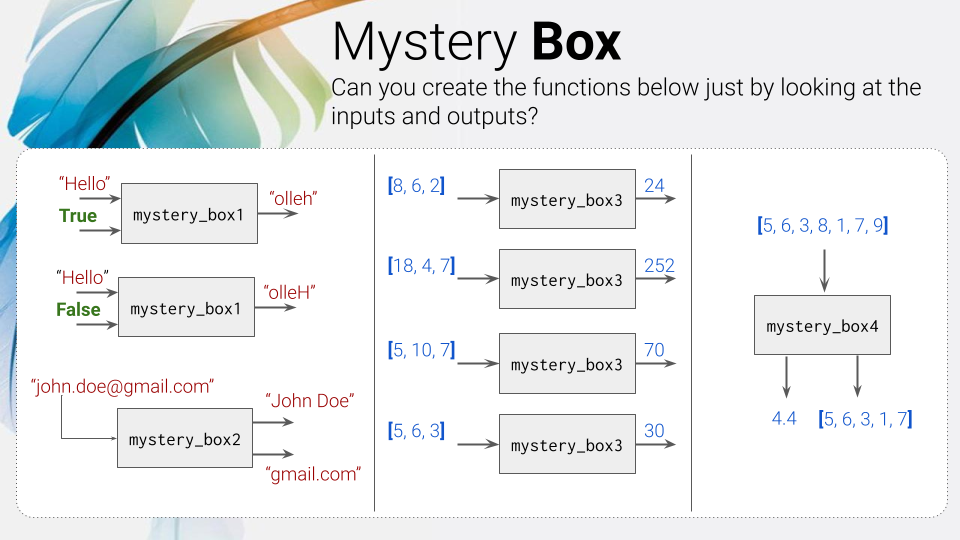

## Mystery Boxes Homework - Functions in Python



### Mystery Box 01

```.py
def mystery_box1(word, capitalize):
    result = " "

    if capitalize == True:
        word = word.title()

    for i in range(len(word)-1, -1, -1):
        result += word[i]

    return result
```

### Mystery Box 02

```.py
def mystery_box2(mail):
    x = mail.split("@")
    name = (str(x[0]).split("."))
    cap_names = (name[0].capitalize() + " "+  name[1].capitalize())
    domain = (x[1])

    return str(cap_names + "\n" + domain)
```

### Mystery Box 03

```.py
def mystery_box3(num1, num2, num3):
    result = 0
    i = 0
    acco = False

    while acco == False:
        i += 1
        if i % num1 == 0 and i % num2 == 0 and i % num3 == 0:
            result = i
            acco = True
    return result
```

### Mystery Box 04

```.py
def mystery_box4(num1, num2, num3, num4, num5, num6, num7):
    listu = [num1,num2, num3, num4, num5, num6, num7]
    corr_listu = []
    for i in range(len(listu)-1):
        if listu[i] <= 7:
            corr_listu.append(listu[i])

    average = sum(corr_listu)/len(corr_listu)

    return str(str(average) + "\n" + str(corr_listu))
```
