## While Loop Exercises

### 1.- List of Squares

While Loop Solution:

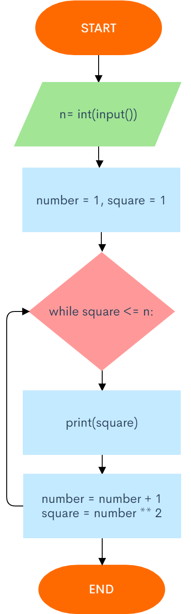

```.py
n = int(input("Input the n number"))
number = 1
square = 1

while square <= n:
    print(square)
    number = number + 1
    square = number ** 2
```

### 2.- Least Divisor

While Loop Solution:

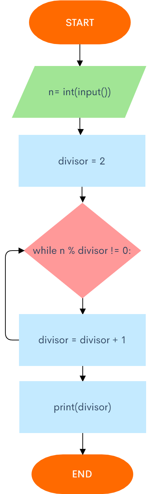

```.py
n = int(input("Enter an integer no less than 2"))
divisor = 2

while n % divisor != 0:
    divisor = divisor + 1
print(divisor)
```

### 3.- The power of 2

While Loop Solution:

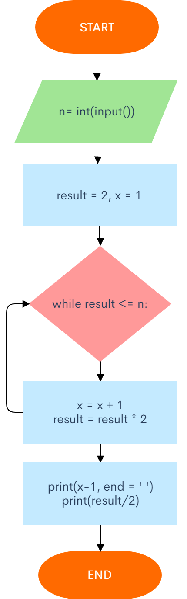

```.py
n = int(input("Input an n term"))
result = 2
x = 1
while result <= n:
    x = x + 1
    result = result * 2
print(x-1, end = ' ')
print(result/2)
```

### 4.- Morning jog

While Loop Solution:

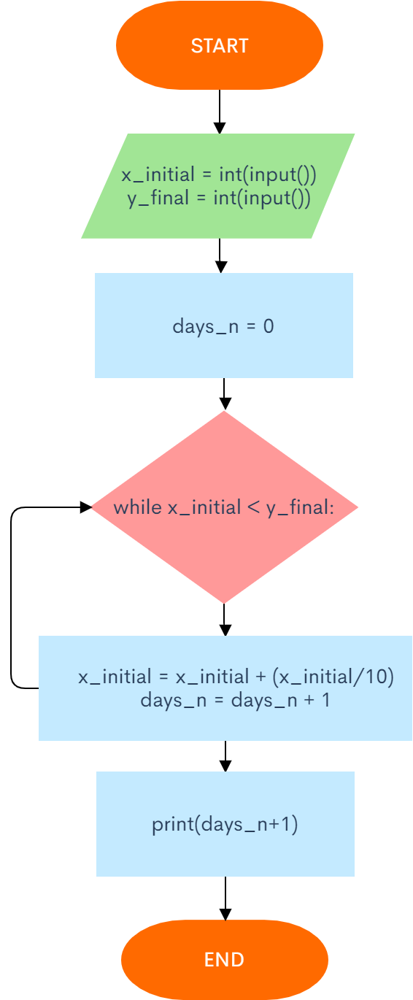

```.py
x_initial = int(input("Original"))
y_final = int(input("Desired:"))

days_n = 0

while x_initial < y_final:
    x_initial = x_initial + (x_initial/10)
    days_n = days_n + 1
print(days_n+1)
```

### 5.- Lenght of a sequence

While Loop Solution:


```.py
n = 1
nums = 0
while n != 0:
    n = int(input())
    nums = nums+1
print(nums-1)
```

### 6.- The sum of a sequence

While Loop Solution:


```.py
n = 1
sum = 0
while n != 0:
    n = int(input())
    sum = sum + n
print(sum)
```

### 7.- Average of a sequence

While Loop Solution:

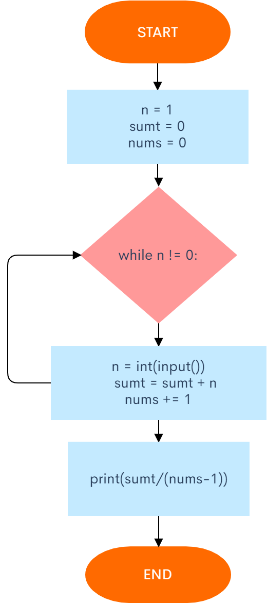

```.py
n = 1
sumt = 0
nums = 0
while n != 0:
    n = int(input())
    sumt = sumt + n
    nums += 1
print(sumt/(nums-1))
```

### 8.- Maximum of a sequence

While Loop Solution:

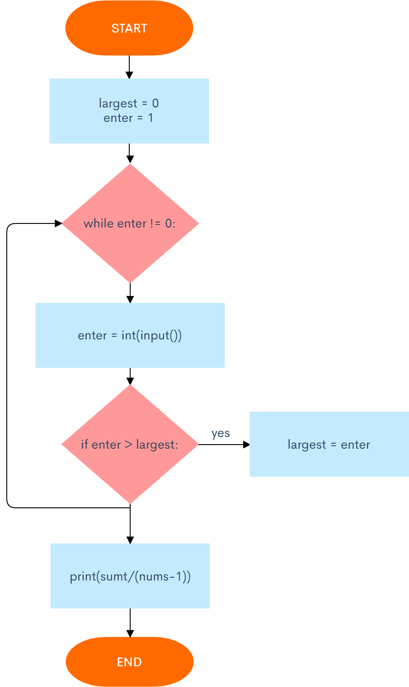

```.py
largest = 0
enter = 1
while enter != 0:
    enter = int(input())
    if enter > largest:
        largest = enter
print(largest)
```

### 9.- Index of the maximum of a sequence

While Loop Solution:

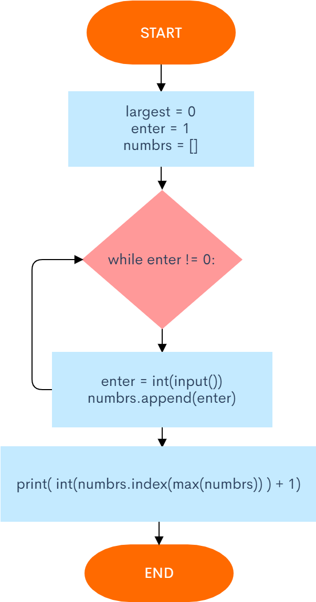

```.py
largest = 0
enter = 1
numbrs = []
while enter != 0:
    enter = int(input())
    numbrs.append(enter)
    
print( int(numbrs.index(max(numbrs)) ) + 1)
```

### 10.- The number of even elements of the sequence

While Loop Solution:

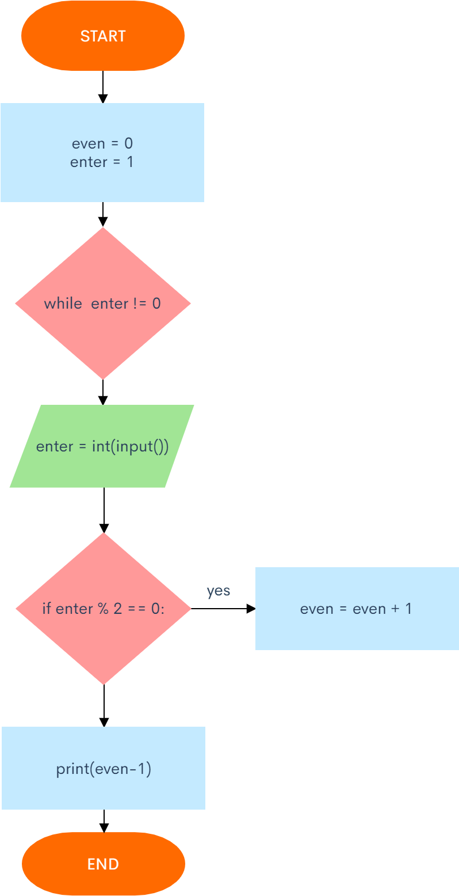

```.py
even = 0
enter = 1
while enter != 0:
    enter = int(input())
    if enter % 2 == 0:
        even = even + 1
print(even-1)
```
### 11.- The number of elements that are greater than the previous one

While Loop Solution:

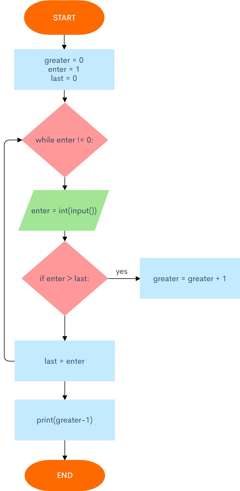

```.py
greater = 0
enter = 1
last = 0

while enter != 0:
    enter = int(input())
    if enter > last:
        greater = greater + 1
    last = enter

print(greater-1)
```

### 12.- The second maximum

While Loop Solution:

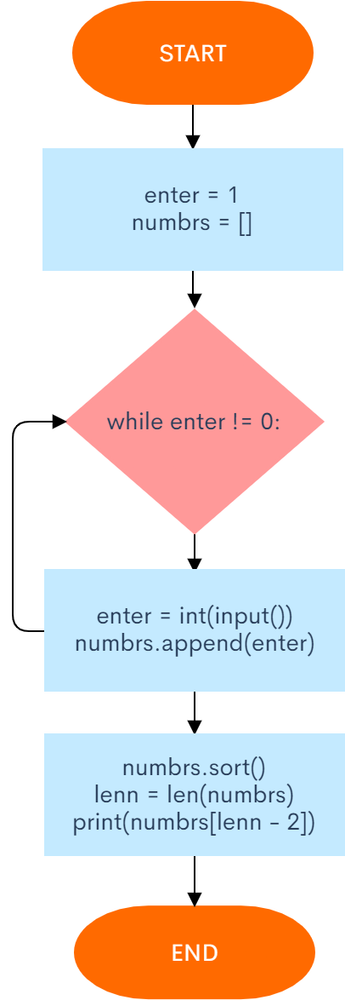

```.py
enter = 1
numbrs = []
while enter != 0:
    enter = int(input())
    numbrs.append(enter)
    
numbrs.sort()
lenn = len(numbrs)

print(numbrs[lenn - 2])
``` 

### 13.- The number of elements equal to the maximum

While Loop Solution:

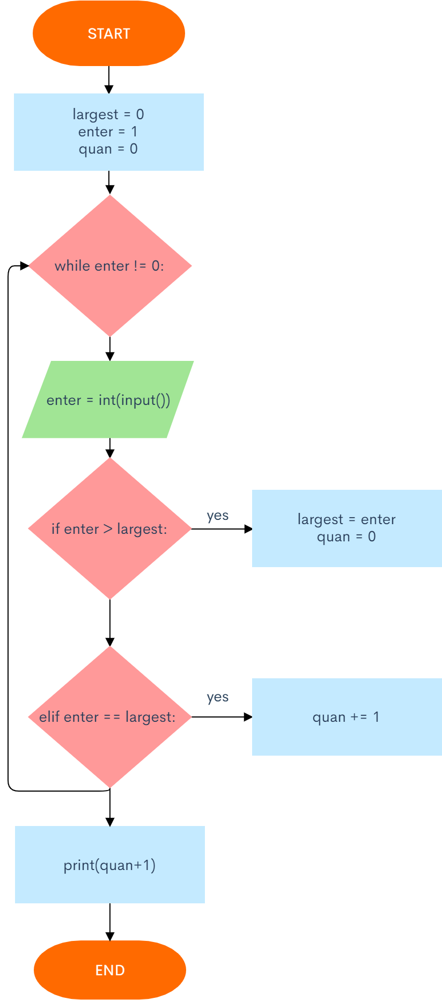

```.py
largest = 0
enter = 1
quan = 0
while enter != 0:
    enter = int(input())
    if enter > largest:
        largest = enter
        quan = 0
    elif enter == largest:
        quan += 1
    
print(quan+1)
```

### 14.- The index of a Fibonacci number

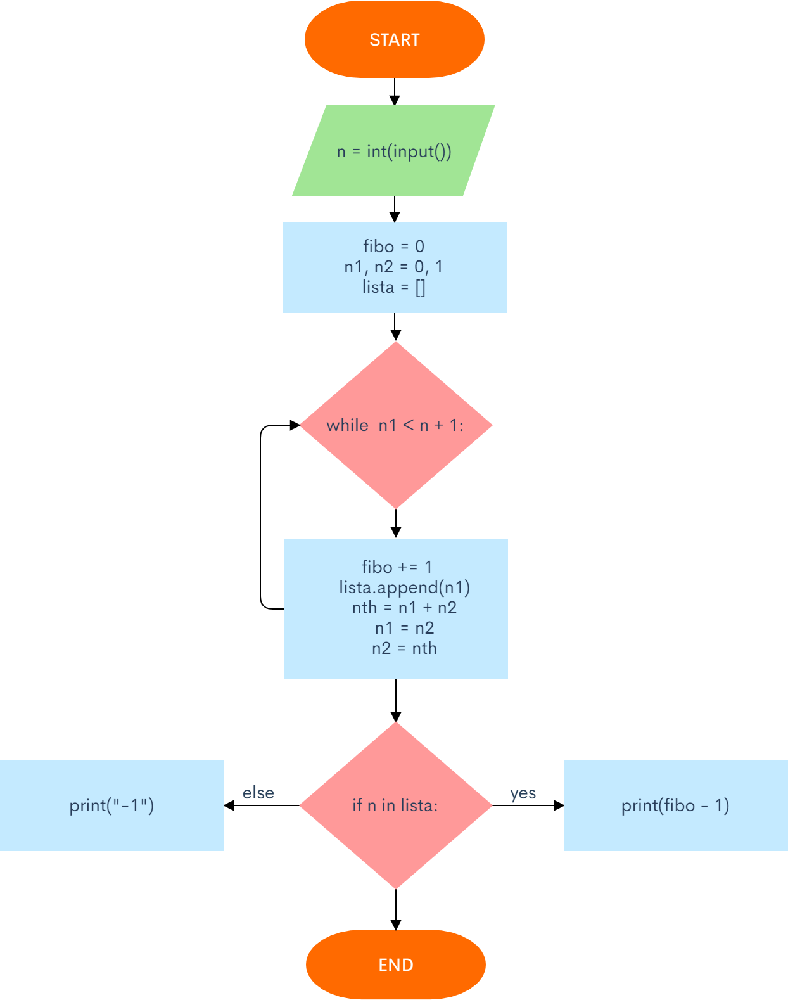

While Loop Solution:
```.py
n = int(input("Enter the term you wish to determine index from fibonacci numbers"))

fibo = 0
n1, n2 = 0, 1
lista = []

while n1 < n + 1:
    fibo += 1
    lista.append(n1)
    nth = n1 + n2
    n1 = n2
    n2 = nth


if n in lista:
    print(fibo - 1)
else:
    print("-1")
```

### 15.- The maximum number of consecutive equal elements

While Loop Solution:

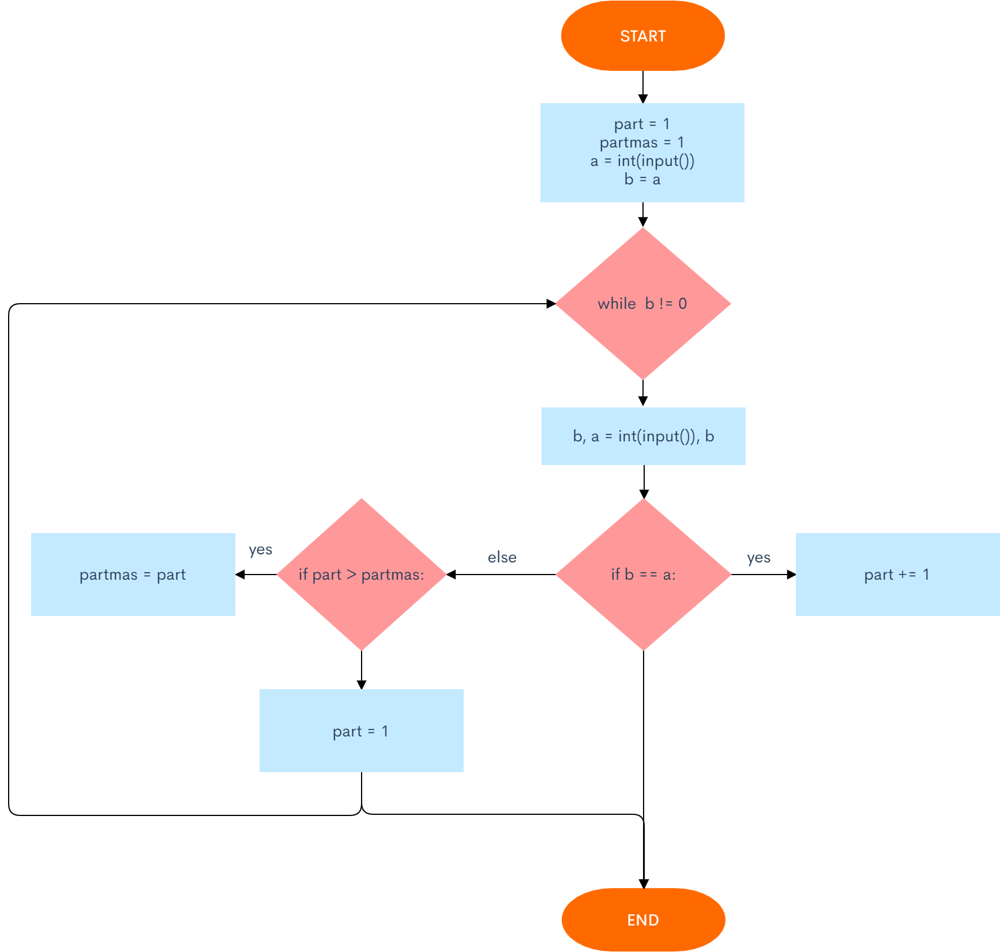

```.py
part = 1
partmas = 1
a = int(input())
b = a

while b != 0:
    b, a = int(input()), b
    if b == a:
        part += 1
    else:
        if part > partmas:
            partmas = part
        part = 1

print(partmas)
```
